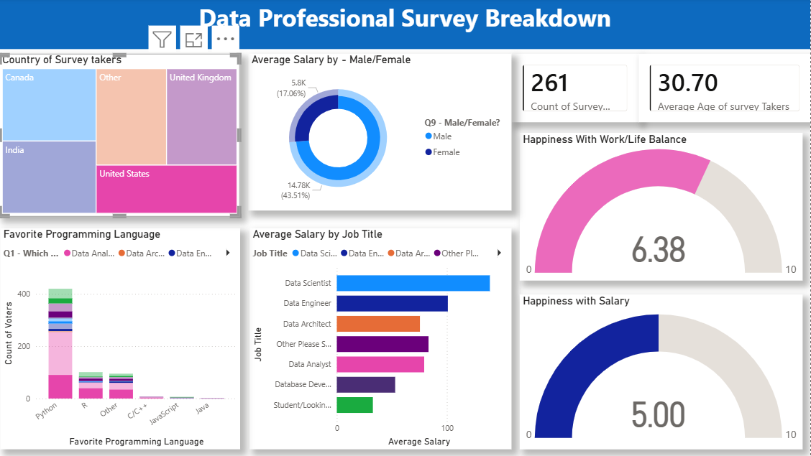

# Data Professional Survey Dashboard

## Project Overview

This project analyzes survey data of data professionals using Power BI.

## Tools Used

* Power BI
* Excel
* Data Visualization

## Key Insights

* Python is the most popular programming language.
* Data Scientists earn the highest average salary.
* Salary satisfaction score is relatively low.

## Dashboard Preview

## Files

* Data_professional_survey_breakdown_Project_Interactive.pbix
* Survey_dataset.xlsx
* Dashboard.png
